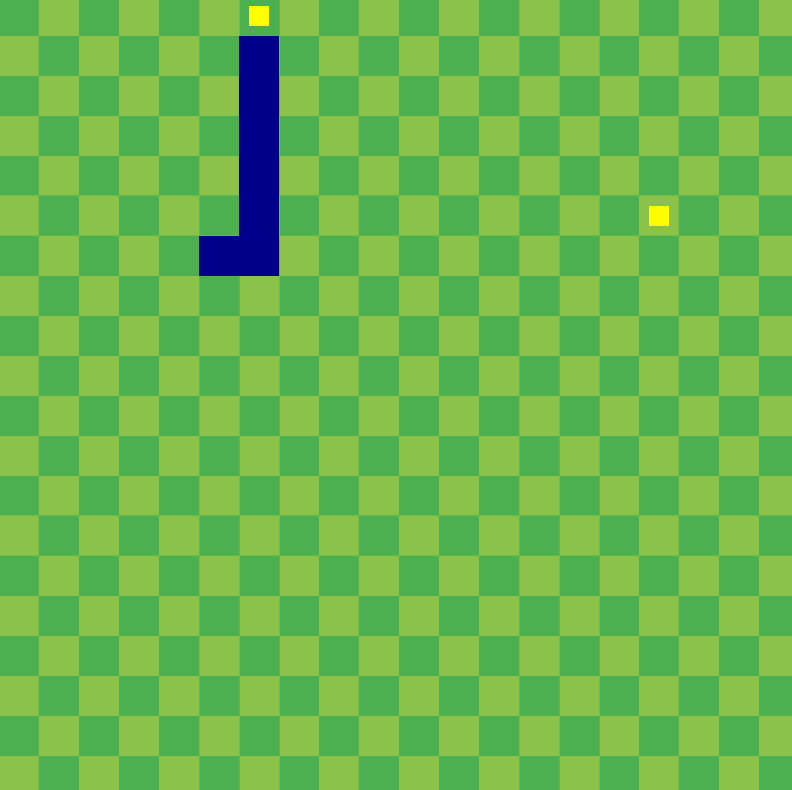

# 🐍 Snake 2D

[](https://en.cppreference.com/w/cpp/20)
[](https://www.opengl.org/)
[](https://www.glfw.org/)
[](https://www.microsoft.com/windows)
[](#)

A classic, fast-paced arcade Snake game engineered from scratch in **C++20** and modern **OpenGL 4.6 (Core Profile)**. Features custom GLSL shaders, procedural grid geometry in Normalized Device Coordinates (NDC), a tiled checkerboard arena, dual simultaneous fruit spawning with anti-overlap placement, instant 180-degree anti-suicide direction locks, and dynamic window title score tracking.

---

## 📸 In-Game Preview



*Real-time gameplay showcasing procedural NDC grid geometry, dual fruit spawning, checkerboard arena floor, and dynamic tail growth.*

---

## 🕹️ Controls & Hotkeys

| Action / Player | Keybinding | Description |
| :--- | :--- | :--- |
| **Move Up** | <kbd>▲</kbd> *(Up Arrow)* | Direct the snake upward (blocked if currently moving down) |
| **Move Down** | <kbd>▼</kbd> *(Down Arrow)* | Direct the snake downward (blocked if currently moving up) |
| **Move Left** | <kbd>◄</kbd> *(Left Arrow)* | Direct the snake leftward (blocked if currently moving right) |
| **Move Right** | <kbd>►</kbd> *(Right Arrow)* | Direct the snake rightward (blocked if currently moving left) |
| **Restart Game** | <kbd>Enter</kbd> | Reset score, clear board, respawn fruits, and restart round after Game Over |

---

## ⚙️ How the Game Runs

### 1. 🔄 The Game Loop & Discrete Tick Timing
* **Fixed-Interval Tick Architecture:** Rather than moving continuously every frame, the simulation is regulated by a discrete move accumulator (`moveInterval = 0.15s` ≈ 6.67 ticks/second) using `glfwGetTime()`. Input is registered instantaneously, but segment translation is locked to clock ticks to preserve clean grid alignment.
* **Separation of Concerns:** Each iteration of the main loop sequentially executes:
  1. **Input Polling:** Reads keyboard state via GLFW and queues direction changes while preventing invalid 180-degree reversals.
  2. **Movement & Tail Simulation:** Shifts each body segment into the preceding segment's position, then translates the head in the active direction.
  3. **Collision Detection:** Tests whether the head breached the 20×20 grid perimeter or intersected any trailing body segment.
  4. **Fruit Consumption & Growth:** Checks head intersection against both active fruits, increases snake length, respawns the eaten fruit, and increments score.
  5. **Render Pass:** Binds VAOs/VBOs/EBOs, streams uniforms (`offset`, `color`) to custom shaders, and renders the background, fruits, and snake segments.
  6. **Buffer Swapping:** Swaps front and back buffers via double-buffering for flicker-free rendering.

### 2. 📐 Normalized Coordinate Space (NDC) & Grid Mapping
* The entire arena operates in OpenGL **Normalized Device Coordinates (NDC)** ranging from `[-1.0, 1.0]` across both axes:
  * **Grid Resolution:** 20×20 cells.
  * **Tile Dimensions:** `TILE_WIDTH = 0.10` NDC, `TILE_HEIGHT = 0.10` NDC (`2.0 / 20 = 0.10`).
  * **Grid-to-NDC Coordinate Mapping:**
    * `ndcX = -1.0 + (gridX * TILE_WIDTH)`
    * `ndcY = -1.0 + (gridY * TILE_HEIGHT)`
  * **Perimeter Boundaries:** Off-screen boundary triggers when `x < 0`, `x >= 20`, `y < 0`, or `y >= 20`.

### 3. 🎨 Modern OpenGL Rendering Pipeline
* **Core Profile 4.6:** Zero reliance on deprecated legacy immediate-mode (`glBegin`/`glEnd`). All geometry is represented through Vertex Array Objects (**VAO**), Vertex Buffer Objects (**VBO**), and Element Buffer Objects (**EBO**).
* **Two Specialized GLSL Shaders:**
  * `default.vert` & `default.frag`: Renders the full-screen quad textured with `checkerboard.png`. Texture coordinates are scaled to `2.5f` to produce repeating checkerboard tiling.
  * `snake.vert` & `snake.frag`: Geometry pass using a single reusable unit tile quad transformed via `uniform vec2 offset` and colored via `uniform vec3 color`.
* **Padded Fruit Geometry:** While snake segments fill the entire `0.10 x 0.10` tile, fruit vertices apply a 25% inward padding (`PADDING = 0.25f`), creating centered gems that are visually distinct from the snake body.

---

## ✨ Features & Game Mechanics

### 🍎 1. Dual-Fruit Spawning & Anti-Overlap Placement
* **Simultaneous Fruit Array:** Unlike traditional Snake games with a single fruit, two fruits exist on the board at all times (`fruits[2]`).
* **Intelligent Spawn Validation:** The `SpawnFruit(index)` generator guarantees that:
  1. A fruit never spawns inside any segment of the snake's body.
  2. Fruit 0 and Fruit 1 never spawn on top of each other.
* **Selective Respawning:** When the snake eats a fruit, only that specific fruit is relocated, keeping the other fruit intact on the board.

### 🛡️ 2. Anti-Suicide Direction Locking
* In naive Snake implementations, pressing an opposite direction (e.g., Left while moving Right) can instantly cause self-collision.
* This engine tracks `lastMovedDir` (the actual direction moved on the last physical tick) independently from `currentDir` (the requested input direction). Inputs that directly oppose `lastMovedDir` are filtered out, preventing accidental suicides.

### 🐍 3. Segment Propagation & Collision Physics
* **Tail Dragging Algorithm:** At each movement tick, segments iterate backwards from `snake.size() - 1` down to `1`, adopting the coordinate of segment `i - 1`. The head segment (`snake[0]`) then steps into the next grid coordinate.
* **Self-Intersection Testing:** Iterates through `snake[1]` to `snake.back()`. If the head shares coordinates with any body segment, `gameOver` is triggered immediately.

### 🏆 4. Dynamic HUD & Visual State Feedback
* **Score & Growth:** Consuming a fruit appends a new segment to the tail and awards **+20 points**.
* **Dynamic Window Title:** The game continuously synchronizes the active score with the OS window title bar:
  `Snake - Score: 140`
* **Visual Death Feedback:** Upon Game Over, the fruits dynamically shift from golden yellow (`rgb(1.0, 1.0, 0.0)`) to crimson red (`rgb(1.0, 0.0, 0.0)`), signaling failure until <kbd>Enter</kbd> is pressed to reset.

---

## 🗂️ Project Structure

```text
Snake-2D-DEMO/
├── assets/
│   ├── gameplay.png              # In-game preview screenshot
│   ├── shaders/
│   │   ├── default.vert          # Checkerboard backdrop vertex shader
│   │   ├── default.frag          # Texture sampler fragment shader
│   │   ├── snake.vert            # Dynamic tile offset vertex shader
│   │   └── snake.frag            # Uniform color fragment shader
│   └── textures/
│       └── checkerboard.png      # Tiled retro arena floor texture
├── Dependencies/
│   ├── GLAD/                     # OpenGL loader (glad.c and API headers)
│   ├── GLFW/                     # Windowing & input library (headers + MinGW binaries)
│   └── stb/                      # stb_image.h image loading library
├── source/
│   ├── Snake.cpp                 # Main game loop, grid logic, input & rendering
│   └── engine/                   # Modern OpenGL object abstractions
│       ├── EBO.h / EBO.cpp       # Element Buffer Object wrapper
│       ├── VAO.h / VAO.cpp       # Vertex Array Object wrapper
│       ├── VBO.h / VBO.cpp       # Vertex Buffer Object wrapper
│       ├── ShaderClass.h / .cpp  # GLSL shader program compilation & linking
│       ├── Texture.h / Texture.cpp # OpenGL 2D texture generation & binding
│       ├── glad.c                # GLAD OpenGL loader source
│       └── stb.cpp               # stb_image implementation translation unit
├── .vscode/                      # VS Code tasks & launch configuration
├── build.ps1                     # Automated build, link, asset copy, and run script
└── README.md                     # Project documentation
```

---

## 🚀 How to Build and Run

### 📋 Prerequisites
* **Operating System:** Windows 10 or Windows 11 (64-bit)
* **Compiler:** MinGW-w64 (`g++` with C++20 support)
  * Easily installed via WinGet:
    ```powershell
    winget install BrechtSanders.WinLibs.POSIX.UCRT
    ```
  * Or verify with: `g++ --version`
* **Shell:** PowerShell 5.1+

---

### Option 1: Automated PowerShell Script (Recommended)

Run the included automated build script from the project root:

```powershell
.\build.ps1
```

* Automatically detects `g++` from system `PATH` or WinGet directories.
* Statically links MinGW runtime libraries (`-static -static-libgcc -static-libstdc++`) for maximum portability.
* Compiles all engine units, copies the `assets/` directory to `Debug/`, and immediately launches `Snake.exe`.

> **Compile only (without launching):**
> ```powershell
> .\build.ps1 -NoRun
> ```

---

### Option 2: Visual Studio Code

1. Open the `Snake-2D-DEMO` folder in **Visual Studio Code**.
2. Press <kbd>F5</kbd> (or open the **Run & Debug** panel and select launch).
3. Alternatively, press <kbd>Ctrl</kbd> + <kbd>Shift</kbd> + <kbd>B</kbd> to run the build task.

---

### Option 3: Manual Command-Line Build (MinGW g++)

You can compile the executable manually using PowerShell:

```powershell
g++ -std=c++20 -mwindows -static -static-libgcc -static-libstdc++ `
  source/Snake.cpp `
  source/engine/glad.c `
  source/engine/EBO.cpp `
  source/engine/ShaderClass.cpp `
  source/engine/stb.cpp `
  source/engine/Texture.cpp `
  source/engine/VAO.cpp `
  source/engine/VBO.cpp `
  -Isource `
  -Isource/engine `
  -IDependencies/GLAD/include `
  -IDependencies/GLFW/include `
  -IDependencies/stb `
  -LDependencies/GLFW/lib-mingw-w64 `
  -lglfw3 -lopengl32 -lgdi32 `
  -o Debug/Snake.exe

# Copy assets and launch
Copy-Item -Path "assets" -Destination "Debug" -Recurse -Force
.\Debug\Snake.exe
```

---

### Option 4: Direct Precompiled Execution

If the project has already been built:

```powershell
.\Debug\Snake.exe
```

---

## 🛠️ Troubleshooting & Notes

* **Windows Smart App Control (SAC) / Defender Notice:**
  On modern Windows 11 systems, Smart App Control or local execution policies may block freshly compiled, unsigned `.exe` files. If blocked:
  1. Open **Windows Settings** → **Privacy & Security** → **Windows Security**.
  2. Click **App & browser control** → **Smart App Control settings**.
  3. Set to **Off** or enable **Developer Mode** in **System → For Developers**.
* **Missing Assets / Textures at Launch:**
  Ensure the `assets/` directory (containing `shaders/` and `textures/`) is present in the working directory from which `Snake.exe` is launched (the `build.ps1` script copies it to `Debug/` automatically).
* **Header Ordering Notice:**
  If modifying the source code, always make sure `<glad/glad.h>` is included **before** `<GLFW/glfw3.h>` to avoid OpenGL header redefinition conflicts.
